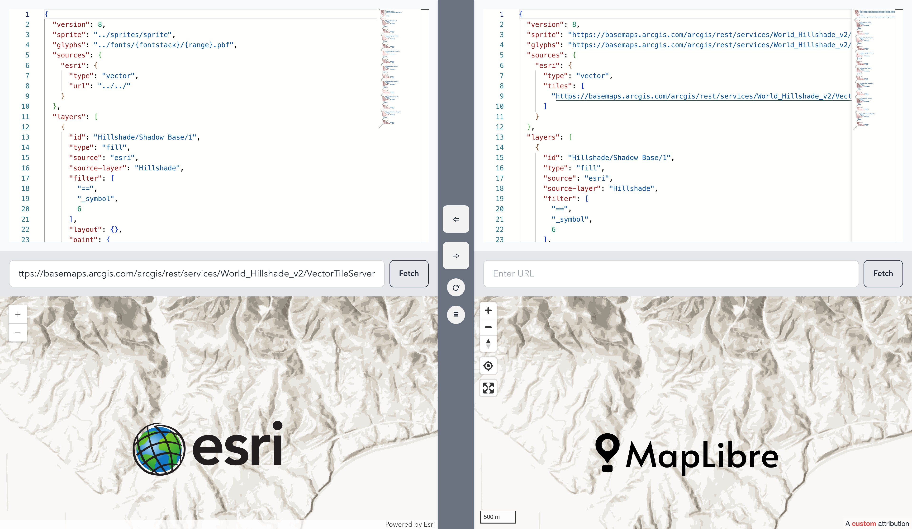

# Esri Style to Mapbox Style Converter (Vector Tiles - PBF)

This project provides a utility for converting Esri Vector Tile Styles to Mapbox Style specifications, facilitating the integration and usage of Esri-hosted vector tiles within Mapbox applications. The conversion process preserves source properties like attribution, bounds, minzoom, maxzoom, scheme, etc., ensuring a seamless transition between Esri and Mapbox style formats.



## Current Status

- ✅ The conversion from Esri to Mapbox style specifications is fully supported and operational.
- ❌ The conversion from Mapbox to Esri style specifications is not yet implemented.

## How to Use

### Installation

Start by installing the package using npm. Run the following command in your project directory:

```sh
npm install esri-style-ft-mapbox-style
```

Example Usage

After installation, you can use the constructMapboxStyleFromEsri function to convert an Esri style to a Mapbox style. Here's a short example demonstrating how to perform the conversion:

```typescript
import { constructMapboxStyleFromEsri } from "esri-style-ft-mapbox-style";

// Specify the base URL of your Esri Vector Tile Service
const esriBaseUrl =
  "https://basemaps.arcgis.com/arcgis/rest/services/World_Basemap_v2/VectorTileServer";

(async () => {
  try {
    // Convert the Esri style to a Mapbox-compatible style
    const mapboxStyle = await constructMapboxStyleFromEsri(esriBaseUrl);

    // Output the converted style
    console.log(
      "Converted Mapbox Style:",
      JSON.stringify(mapboxStyle, null, 2)
    );
  } catch (error) {
    console.error("Error converting Esri style to Mapbox style:", error);
  }
})();
```

This example fetches the default Esri style JSON from the provided Esri service URL, converts it to a Mapbox style, and outputs the result.

## Contributions

Contributions are welcome, especially in implementing the conversion from Mapbox to Esri style specifications. If you're interested in contributing, please open an issue or pull request in this repository.

## License

This project is licensed under the MIT License - see the LICENSE file for details.
